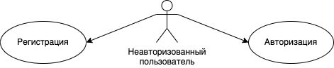
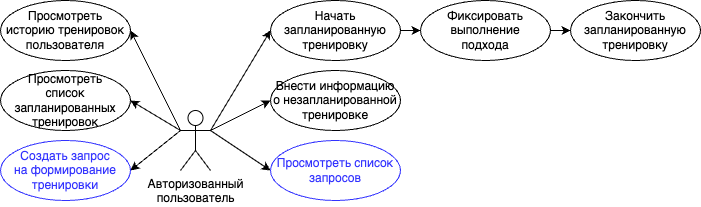
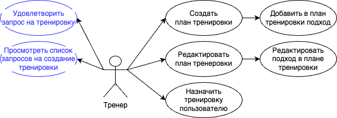
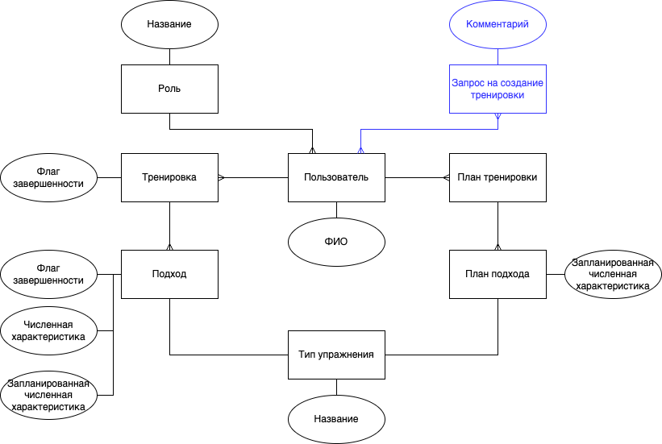
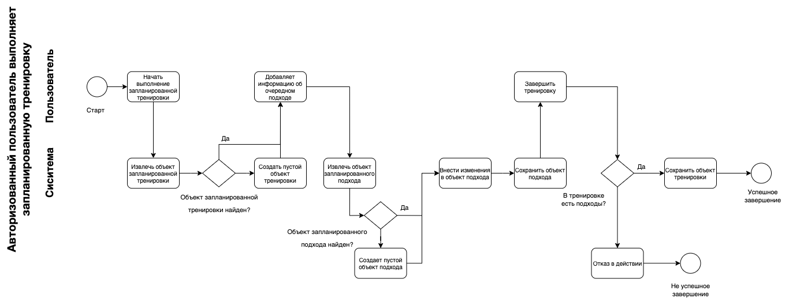
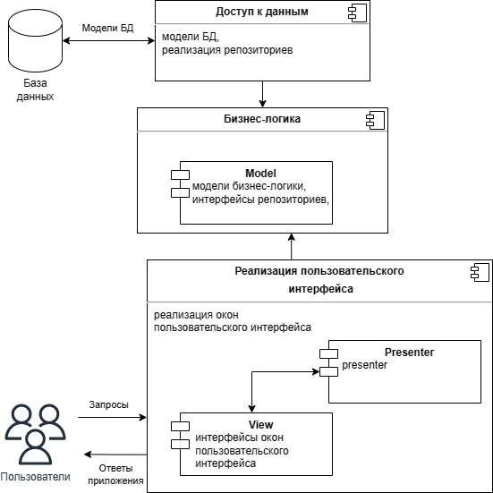
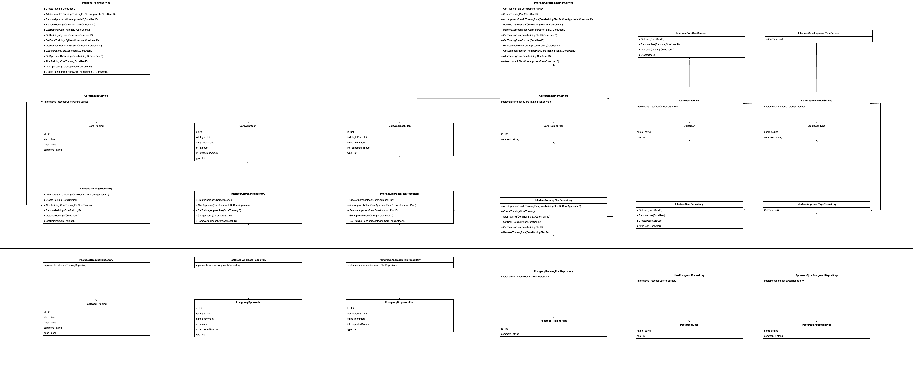
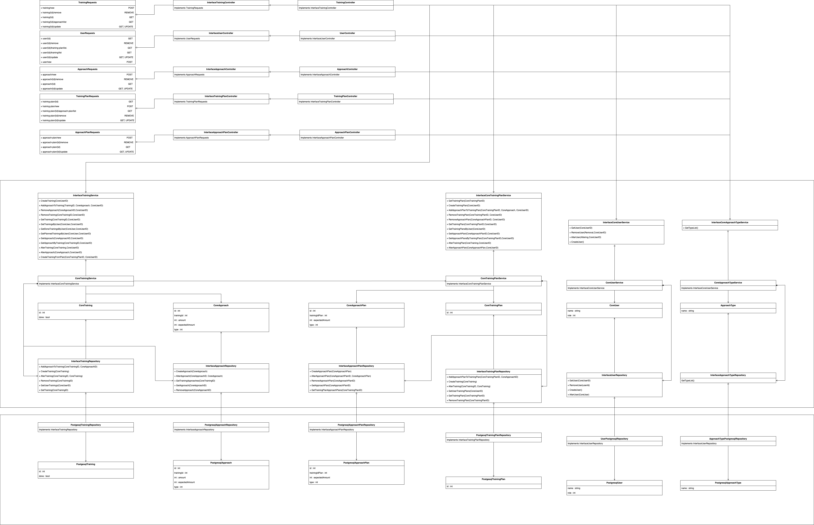
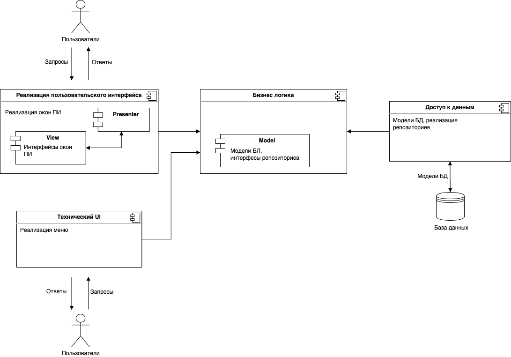

# Training Exchange

   Training Exchange — это сервис, который позволяет создавать, редактировать и делиться тренировками. Пользователь может фиксировать свою физическую активность и отслеживать динамику изменения ее количественных показателей. Благодаря возможности делиться тренировками, Training Exchange может помочь в организации удаленных занятий спортом.

   Предметная область данного проекта — спортивная активность, упражнения и тренировки.

   Критерии анализа аналогичных решений:

1. Возможность создавать пользовательские тренировки (Критерий 1);

2. Возможность делиться тренировками (Критерий 2);

3. Решение предоставляет весь свой функционал бесплатно (Критерий 3).

   Аналогичные решения:

4. «200 Отжиманий»

5. «Кубики за 30 дней»

   Таблица сравнения

|            | «200 Отжиманий» | «Кубики за 30 дней» | Training Exchange |
| ---------- | --------------- | ------------------- | ----------------- |
| Критерий 1 | нет             | нет                 | да                |
| Критерий 2 | нет             | нет                 | да                |
| Критерий 3 | нет             | нет                 | да                |

   Данный продукт предлагает «новые» возможности для организации занятий спортом. Идея «обмена» тренировками не сильно распространена, поэтому есть смысл ее опробовать.

### **Use-Case - диаграмма**

### **ER-диаграмма сущностей**

### **Пользовательские сценарии**

**Авторизованный пользователь выполняет запланированную тренировку**

| №    | Действующее лицо | Действие                                       | Альтернативный сценарий                              |
| ---- | ---------------- | ---------------------------------------------- | ---------------------------------------------------- |
| 1    | Пользователь     | Начинает выполнение запланированной тренировки |                                                      |
| 2    | Система          | Извлекает объект запланированной тренировки    | Обект запланированной тренировки не найден           |
| 3    | Система          |                                                | Создает пустой объект тренировки                     |
| 4    | Пользователь     | Добавляет информацию об очередном подходе      |                                                      |
| 5    | Система          | Извлекает объект запланированного подхода      | Объект запланированного подхода не найден            |
| 6    | Система          |                                                | Создает пустой объект подхода                        |
| 7    | Система          | Вносит изменения в объект подхода              |                                                      |
| 8    | Система          | Сохраняет объект подхода                       |                                                      |
| 9    | Пользователь     | Завершает тренировку                           | Попытка завершить тренировку, в которой нет подходом |
| 10   | Система          | Фиксирует завершение тренировки                | Отказ в действии                                     |
| 11   | Система          | Сохраняет обект тренировки                     |                                                      |

**Авторизованный пользователь планирует тренировку**

| №    | Действующее лицо | Действие                                  | Альтернативный сценарий                             |
| ---- | ---------------- | ----------------------------------------- | --------------------------------------------------- |
| 1    | Пользователь     | Выбирает пункт "запланировать тренировку" |                                                     |
| 2    | Система          | Создает объект тренировки                 |                                                     |
| 3    | Пользователь     | Добавляет информацию об оередногм подходе |                                                     |
| 4    | Система          | Создает объект подхода                    |                                                     |
| 5    | Система          | Сохраняет объект подхода                  |                                                     |
| 6    | Пользователь     | Завершает создание тренировки             | Создает "пустую" тренировку                         |
| 7    | Система          | Сохраняет объект тренировки               | Отказывает в создании сохранении объекта тренировки |

## Инструменты разработки

- Язык: Java/Kotlin
- Интерфейс: консоль и (web, android-приложение или telegram-бот)
- База данных: Postgres
- Тип приложения: web

## Диаграмма компонентов приложения

## UML диаграмма

## UML диаграмма (6 лаба)

## диаграмма компонентов (6 лаба)

